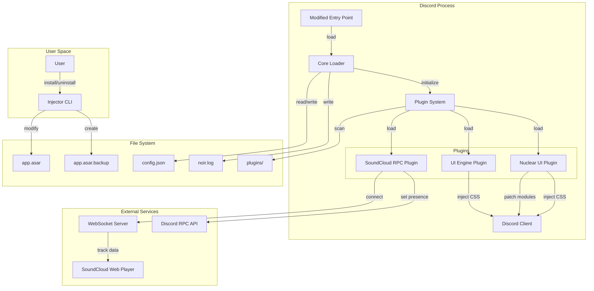

# Design Document: NOIR-Client

## Overview

NOIR-Client is a Discord client modification system built on three core architectural layers: an injector that modifies Discord's Electron entry point, a plugin system that provides extensibility, and a collection of plugins that deliver specific functionality. The system operates entirely within the Discord Desktop application process, using Electron's preload script mechanism to inject code before the Discord UI initializes.

The design prioritizes modularity, allowing plugins to be developed independently while sharing common infrastructure. The two primary plugins are the SoundCloud RPC Plugin (which bridges external music playback to Discord's Rich Presence API) and the Nuclear UI Plugin (which provides extreme interface optimization with media blocking and compression).

### Key Design Principles

1. **Non-destructive modification**: All changes to Discord are reversible through backup restoration
2. **Plugin isolation**: Plugins operate independently with well-defined interfaces
3. **Graceful degradation**: Plugin failures do not crash Discord or affect other plugins
4. **Performance-first**: Minimal overhead on Discord's rendering and IPC performance
5. **Developer experience**: Fast builds, hot-reloading, and clear debugging capabilities

## Architecture

### System Components



### Component Responsibilities

**Injector (Node.js CLI)**
- Detects Discord installation paths across Windows, macOS, and Linux
- Creates backups of the original app.asar entry point
- Modifies the entry point to load the Core Loader preload script
- Provides uninstallation that restores original state

**Core Loader (Preload Script)**
- Executes before Discord's renderer process initializes
- Loads configuration from the file system
- Initializes the Plugin System
- Provides logging infrastructure
- Manages IPC communication with Discord's main process

**Plugin System**
- Discovers plugins in the designated plugins directory
- Validates plugin implementations against the NoirPlugin interface
- Manages plugin lifecycle (start/stop)
- Maintains plugin registry and state persistence
- Provides event bus for inter-plugin communication

**SoundCloud RPC Plugin**
- Establishes WebSocket connection to external server/extension
- Receives track metadata and playback state
- Translates SoundCloud activity to Discord Rich Presence format
- Handles connection failures with exponential backoff

**UI Engine Plugin**
- Injects CSS into Discord's document head
- Manages theme loading from external files
- Provides hot-reloading for CSS in development mode
- Implements the minimalist dark theme color palette

**Nuclear UI Plugin**
- Extends UI Engine with extreme optimization features
- Implements Webpack module patching for media interception
- Provides media killswitch with click-to-reveal functionality
- Applies extreme compression styling (tight spacing, monospace fonts)
- Renders custom header with Nuclear Mode toggle

### Data Flow

**Initialization Flow**
1. Discord launches → Modified entry point executes
2. Entry point loads Core Loader preload script
3. Core Loader reads configuration from file system
4. Core Loader initializes Plugin System
5. Plugin System scans plugins directory
6. Plugin System instantiates and validates each plugin
7. Plugin System calls `start()` on enabled plugins
8. Plugins register event handlers and inject functionality
9. Discord UI renders with modifications applied

**SoundCloud RPC Flow**
1. SoundCloud RPC Plugin establishes WebSocket connection
2. External server/extension sends track metadata when playback starts
3. Plugin validates and transforms metadata
4. Plugin calls Discord RPC API to set Rich Presence
5. When playback stops, plugin clears Rich Presence
6. On connection failure, plugin attempts reconnection with backoff

**Nuclear UI Media Blocking Flow**
1. Nuclear UI Plugin patches Webpack ImageResolver module
2. Discord attempts to render image/video/GIF
3. Patched module intercepts rendering call
4. Plugin renders grey placeholder with "Click to View" text
5. User clicks placeholder
6. Plugin reveals actual media content
7. Plugin stores reveal state to prevent re-blocking

## Components and Interfaces

### Injector Module

**File**: `src/injector/index.ts`

```typescript
interface DiscordInstallation {
  version: 'stable' | 'canary' | 'ptb';
  path: string;
  appAsarPath: string;
}

interface InjectorOptions {
  targetVersion?: 'stable' | 'canary' | 'ptb';
  force?: boolean;
}

class Injector {
  detectInstallations(): DiscordInstallation[];
  selectInstallation(options: InjectorOptions): DiscordInstallation;
  createBackup(installation: DiscordInstallation): void;
  modifyEntryPoint(installation: DiscordInstallation): void;
  validateModification(installation: DiscordInstallation): boolean;
  uninstall(installation: DiscordInstallation): void;
  restoreBackup(installation: DiscordInstallation): void;
}
```

**Detection Strategy**
- Windows: Check `%LOCALAPPDATA%/Discord`, `%LOCALAPPDATA%/DiscordCanary`, `%LOCALAPPDATA%/DiscordPTB`
- macOS: Check `~/Library/Application Support/Discord`, `~/Library/Application Support/Discord Canary`
- Linux: Check `~/.config/discord`, `~/.config/discordcanary`, `/opt/discord`

**Entry Point Modification**
The injector modifies `app.asar/index.js` to prepend:
```javascript
require('electron').app.on('browser-window-created', (_, window) => {
  window.webContents.on('dom-ready', () => {
    window.webContents.executeJavaScript(`
      require('${CORE_LOADER_PATH}');
    `);
  });
});
```

### Core Loader Module

**File**: `src/core/loader.ts`

```typescript
interface NoirConfig {
  plugins: Record<string, PluginConfig>;
  theme: ThemeConfig;
  logging: LoggingConfig;
  developmentMode: boolean;
}

interface PluginConfig {
  enabled: boolean;
  settings: Record<string, any>;
}

class CoreLoader {
  private config: NoirConfig;
  private pluginSystem: PluginSystem;
  private logger: Logger;
  
  initialize(): void;
  loadConfig(): NoirConfig;
  saveConfig(config: NoirConfig): void;
  shutdown(): void;
}
```

**Configuration File Location**
- Windows: `%APPDATA%/noir-client/config.json`
- macOS: `~/Library/Application Support/noir-client/config.json`
- Linux: `~/.config/noir-client/config.json`

### Plugin System Module

**File**: `src/core/plugin-system.ts`

```typescript
interface NoirPlugin {
  metadata: PluginMetadata;
  start(): Promise<void>;
  stop(): Promise<void>;
  onConfigChange?(config: any): void;
}

interface PluginMetadata {
  name: string;
  version: string;
  author: string;
  description: string;
  dependencies?: string[];
}

interface PluginRegistry {
  [pluginName: string]: {
    instance: NoirPlugin;
    enabled: boolean;
    error?: Error;
  };
}

class PluginSystem {
  private registry: PluginRegistry;
  private pluginsDir: string;
  
  scanPlugins(): Promise<string[]>;
  loadPlugin(path: string): Promise<NoirPlugin>;
  validatePlugin(plugin: any): boolean;
  startPlugin(name: string): Promise<void>;
  stopPlugin(name: string): Promise<void>;
  getPlugin(name: string): NoirPlugin | null;
  listPlugins(): PluginMetadata[];
}
```

**Plugin Discovery**
- Scan `plugins/` directory for `.js` files
- Each file must export a class implementing NoirPlugin
- Plugins are loaded in dependency order (if specified)
- Failed plugins are logged but don't block other plugins

### SoundCloud RPC Plugin

**File**: `src/plugins/soundcloud-rpc/index.ts`

```typescript
interface TrackMetadata {
  title: string;
  artist: string;
  url?: string;
  artwork?: string;
  duration?: number;
}

interface PlaybackState {
  playing: boolean;
  position?: number;
}

interface WebSocketMessage {
  type: 'track' | 'playback' | 'stop';
  data: TrackMetadata | PlaybackState;
}

class SoundCloudRPCPlugin implements NoirPlugin {
  private ws: WebSocket | null;
  private currentTrack: TrackMetadata | null;
  private reconnectAttempts: number;
  private reconnectDelay: number;
  
  start(): Promise<void>;
  stop(): Promise<void>;
  
  private connectWebSocket(): void;
  private handleMessage(message: WebSocketMessage): void;
  private updateRichPresence(track: TrackMetadata): void;
  private clearRichPresence(): void;
  private reconnect(): void;
  private calculateBackoff(): number;
}
```

**WebSocket Protocol**
```json
{
  "type": "track",
  "data": {
    "title": "Track Name",
    "artist": "Artist Name",
    "url": "https://soundcloud.com/...",
    "artwork": "https://...",
    "duration": 180
  }
}

{
  "type": "playback",
  "data": {
    "playing": true,
    "position": 45
  }
}

{
  "type": "stop"
}
```

**Rich Presence Mapping**
- `details`: Track title
- `state`: Artist name
- `largeImageKey`: "soundcloud" (requires asset upload to Discord app)
- `largeImageText`: "SoundCloud"
- `buttons`: [{ label: "Listen on SoundCloud", url: track.url }]

### UI Engine Plugin

**File**: `src/plugins/ui-engine/index.ts`

```typescript
interface ThemeConfig {
  colors: ColorPalette;
  customCSS?: string;
  externalCSSPath?: string;
}

interface ColorPalette {
  background: string;
  primary: string;
  accent: string;
  text: string;
  textSecondary: string;
}

class UIEnginePlugin implements NoirPlugin {
  private styleElement: HTMLStyleElement | null;
  private theme: ThemeConfig;
  
  start(): Promise<void>;
  stop(): Promise<void>;
  
  injectCSS(css: string): void;
  removeCSS(): void;
  loadExternalCSS(path: string): Promise<string>;
  applyTheme(theme: ThemeConfig): void;
  generateThemeCSS(colors: ColorPalette): string;
}
```

**Minimalist Theme CSS Variables**
```css
:root {
  --background-primary: #000000;
  --background-secondary: #000000;
  --background-tertiary: #000000;
  --channeltext-area-placeholder: #1E3A8A;
  --interactive-normal: #1E3A8A;
  --interactive-hover: #3B82F6;
  --interactive-active: #3B82F6;
  --text-normal: #FFFFFF;
  --text-muted: #B0B0B0;
}
```

### Nuclear UI Plugin

**File**: `src/plugins/nuclear-ui/index.ts`

```typescript
interface NuclearConfig {
  enabled: boolean;
  mediaKillswitch: boolean;
  extremeCompression: boolean;
  customHeader: boolean;
}

interface MediaPlaceholder {
  messageId: string;
  mediaId: string;
  revealed: boolean;
  originalSrc: string;
}

class NuclearUIPlugin implements NoirPlugin {
  private config: NuclearConfig;
  private mediaRegistry: Map<string, MediaPlaceholder>;
  private patchedModules: Set<string>;
  
  start(): Promise<void>;
  stop(): Promise<void>;
  
  // Webpack patching
  private findWebpackModules(): any;
  private patchImageResolver(): void;
  private patchEmbedRender(): void;
  private unpatchModules(): void;
  
  // Media killswitch
  private interceptMediaRender(props: any): React.ReactElement;
  private renderPlaceholder(mediaId: string, originalSrc: string): React.ReactElement;
  private revealMedia(mediaId: string): void;
  
  // Styling
  private injectNuclearCSS(): void;
  private removeNuclearCSS(): void;
  
  // Custom header
  private renderCustomHeader(): React.ReactElement;
  private toggleNuclearMode(): void;
}
```

**Webpack Module Search**
```typescript
function findModule(filter: (module: any) => boolean): any {
  const webpackRequire = window.webpackChunkdiscord_app;
  
  for (const moduleId in webpackRequire.c) {
    const module = webpackRequire.c[moduleId];
    if (module?.exports && filter(module.exports)) {
      return module.exports;
    }
  }
  
  return null;
}

// Example usage
const ImageResolver = findModule(m => 
  m?.default?.getUserAvatarURL && 
  m?.default?.getGuildIconURL
);
```

**Nuclear CSS Injection**
```css
/* Extreme compression */
* {
  margin: 2px !important;
  padding: 2px !important;
  font-family: 'VT323', 'Courier New', monospace !important;
  font-size: 0.8em !important;
  border-radius: 0 !important;
}

/* Color palette override */
:root {
  --background-primary: #000000 !important;
  --background-secondary: #000000 !important;
  --interactive-normal: #1E3A8A !important;
  --interactive-hover: #1E3A8A !important;
  --divider-color: #2A2A2A !important;
}

/* Remove unwanted elements */
[aria-label="Send a gift"],
[aria-label="Sticker"],
button[aria-label*="Explore"] {
  display: none !important;
}

/* Disable blur effects */
* {
  backdrop-filter: none !important;
}

/* Server icons */
.guilds-wrapper .guild-icon {
  border-radius: 0 !important;
  width: 40px !important;
  height: 40px !important;
}
```

### Logger Module

**File**: `src/core/logger.ts`

```typescript
enum LogLevel {
  DEBUG = 0,
  INFO = 1,
  WARN = 2,
  ERROR = 3,
  CRITICAL = 4
}

interface LogEntry {
  timestamp: Date;
  level: LogLevel;
  source: string;
  message: string;
  data?: any;
}

class Logger {
  private logFile: string;
  private minLevel: LogLevel;
  private maxFileSize: number;
  
  debug(source: string, message: string, data?: any): void;
  info(source: string, message: string, data?: any): void;
  warn(source: string, message: string, data?: any): void;
  error(source: string, message: string, data?: any): void;
  critical(source: string, message: string, data?: any): void;
  
  private writeLog(entry: LogEntry): void;
  private rotateLog(): void;
  private formatEntry(entry: LogEntry): string;
}
```

**Log File Location**
- Windows: `%APPDATA%/noir-client/logs/noir.log`
- macOS: `~/Library/Logs/noir-client/noir.log`
- Linux: `~/.local/share/noir-client/logs/noir.log`

**Log Rotation**
- Max file size: 10MB
- Keep last 5 rotated logs
- Format: `noir.log`, `noir.log.1`, `noir.log.2`, etc.

## Data Models

### Configuration Schema

```typescript
interface NoirConfig {
  version: string;
  plugins: {
    'soundcloud-rpc': {
      enabled: boolean;
      websocketUrl: string;
      reconnectDelay: number;
      maxReconnectAttempts: number;
    };
    'ui-engine': {
      enabled: boolean;
      theme: {
        colors: {
          background: string;
          primary: string;
          accent: string;
          text: string;
          textSecondary: string;
        };
        customCSS?: string;
        externalCSSPath?: string;
      };
    };
    'nuclear-ui': {
      enabled: boolean;
      mediaKillswitch: boolean;
      extremeCompression: boolean;
      customHeader: boolean;
    };
  };
  logging: {
    level: 'debug' | 'info' | 'warn' | 'error' | 'critical';
    maxFileSize: number;
    rotationCount: number;
  };
  developmentMode: boolean;
}
```

**Default Configuration**
```json
{
  "version": "1.0.0",
  "plugins": {
    "soundcloud-rpc": {
      "enabled": false,
      "websocketUrl": "ws://localhost:8080",
      "reconnectDelay": 1000,
      "maxReconnectAttempts": 10
    },
    "ui-engine": {
      "enabled": true,
      "theme": {
        "colors": {
          "background": "#000000",
          "primary": "#1E3A8A",
          "accent": "#3B82F6",
          "text": "#FFFFFF",
          "textSecondary": "#B0B0B0"
        }
      }
    },
    "nuclear-ui": {
      "enabled": false,
      "mediaKillswitch": true,
      "extremeCompression": true,
      "customHeader": true
    }
  },
  "logging": {
    "level": "info",
    "maxFileSize": 10485760,
    "rotationCount": 5
  },
  "developmentMode": false
}
```

### Plugin Metadata Schema

```typescript
interface PluginMetadata {
  name: string;           // Unique identifier (kebab-case)
  version: string;        // Semantic version (e.g., "1.0.0")
  author: string;         // Author name or organization
  description: string;    // Brief description of functionality
  dependencies?: string[]; // Array of plugin names this plugin depends on
  homepage?: string;      // URL to documentation or repository
  license?: string;       // License identifier (e.g., "MIT")
}
```

### WebSocket Message Schema

```typescript
// Track update message
interface TrackMessage {
  type: 'track';
  data: {
    title: string;
    artist: string;
    url?: string;
    artwork?: string;
    duration?: number;
  };
}

// Playback state message
interface PlaybackMessage {
  type: 'playback';
  data: {
    playing: boolean;
    position?: number;
  };
}

// Stop message
interface StopMessage {
  type: 'stop';
}

type WebSocketMessage = TrackMessage | PlaybackMessage | StopMessage;
```

### Media Registry Schema

```typescript
interface MediaPlaceholder {
  messageId: string;      // Discord message ID
  mediaId: string;        // Unique identifier for this media item
  revealed: boolean;      // Whether user has clicked to reveal
  originalSrc: string;    // Original media URL
  type: 'image' | 'video' | 'gif';
  timestamp: number;      // When placeholder was created
}

// Stored in memory as Map<string, MediaPlaceholder>
// Key: mediaId
// Value: MediaPlaceholder object
```

